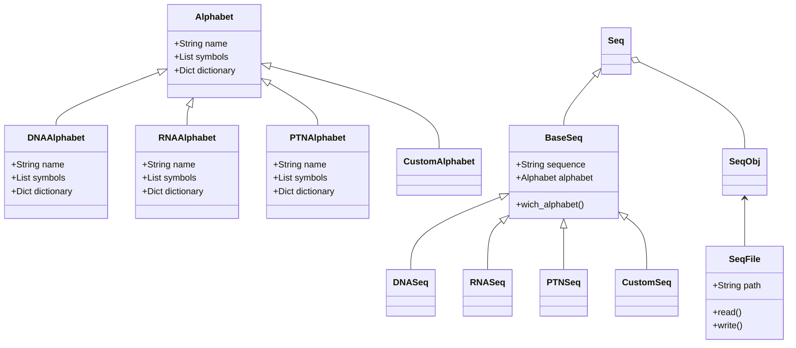

# Diagrama de classes

```mermaid

classDiagram

class Alphabet{
    +String name
    +List symbols
    +Dict dictionary
}
class DNAAlphabet{
    +String name
    +List symbols
    +Dict dictionary
}
class RNAAlphabet{
    +String name
    +List symbols
    +Dict dictionary
}
class PTNAlphabet{
    +String name
    +List symbols
    +Dict dictionary
}

class BaseSeq{
    +String sequence
    +Alphabet alphabet
    +wich_alphabet()
}

class DNASeq{}
class RNASeq{}
class PTNSeq{}
class CustomSeq{}

class Seq{}
class SeqObj{}

class SeqFile{
    +String path
    +read()
    +write()
}

Alphabet <|-- DNAAlphabet
Alphabet <|-- RNAAlphabet
Alphabet <|-- PTNAlphabet
Alphabet <|-- CustomAlphabet

BaseSeq <|-- DNASeq
BaseSeq <|-- RNASeq
BaseSeq <|-- PTNSeq
BaseSeq <|-- CustomSeq

Seq |>-- BaseSeq
Seq o-- SeqObj

SeqObj >-- SeqFile

```
