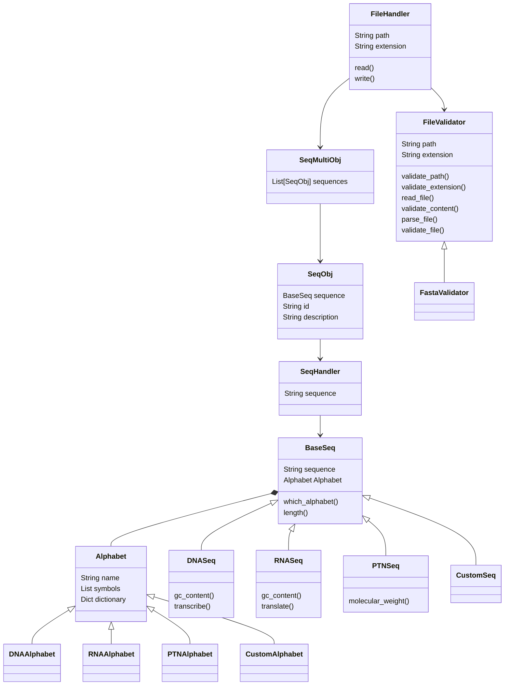

# Diagrama de classes

```mermaid

classDiagram

    class Alphabet{
        String name
        List symbols
        Dict dictionary
    }
    class DNAAlphabet{}
    class RNAAlphabet{}
    class PTNAlphabet{}
    class CustomAlphabet{}

    class BaseSeq{
        String sequence
        Alphabet Alphabet
        which_alphabet()
        length()
    }
    class DNASeq{
        gc_content()
        transcribe()
    }
    class RNASeq{
        gc_content()
        translate()
    }
    class PTNSeq{
        molecular_weight()
    }
    class CustomSeq{}

    class SeqHandler{
        String sequence
    }

    class SeqObj{
        BaseSeq sequence
        String id
        String description
    }
    class SeqMultiObj{
        List[SeqObj] sequences
    }
    class FileHandler{
        String path
        String extension
        read()
        write()
    }
    class FileValidator{
        String path
        String extension
        validate_path()
        validate_extension()
        read_file()
        validate_content()
        parse_file()
        validate_file()
    }
    class FastaValidator{}

    Alphabet <|-- DNAAlphabet
    Alphabet <|-- RNAAlphabet
    Alphabet <|-- PTNAlphabet
    Alphabet <|-- CustomAlphabet

    BaseSeq *-- Alphabet
    BaseSeq <|-- DNASeq
    BaseSeq <|-- RNASeq
    BaseSeq <|-- PTNSeq
    BaseSeq <|-- CustomSeq

    FileValidator <|-- FastaValidator

    FileHandler --> FileValidator
    FileHandler --> SeqMultiObj
    SeqMultiObj --> SeqObj
    SeqObj --> SeqHandler
    SeqHandler --> BaseSeq

```

